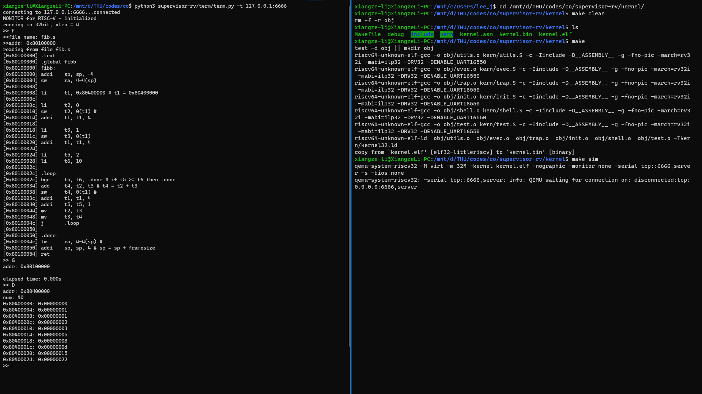
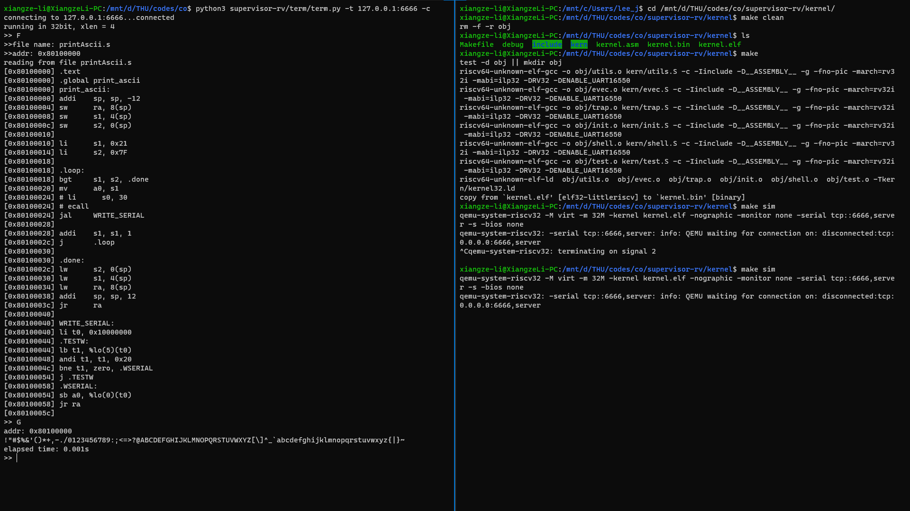
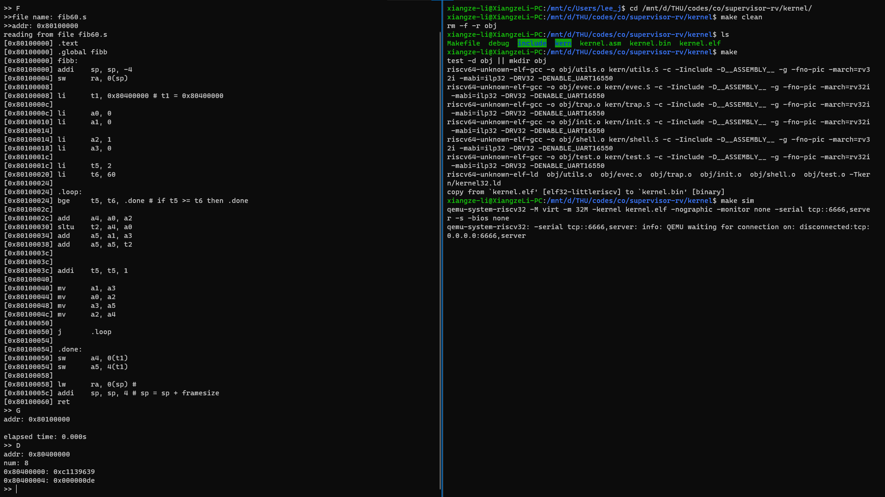

<h1 style="text-align:center">计算机组成原理<br/>实验 1: 熟悉 RISC-V 汇编与监控程序<br/><big>实验报告</big></h1>
<p style="text-align:right">李祥泽<br/><small>2018011331<br/>lee_johnson@qq.com</small></p>

## 实验目的 ##

1.  熟悉 RISC-V 汇编语言编程; 
2.  熟悉监控程序与终端程序的使用和原理. 

## 实验内容 ##

阅读监控程序源代码, 使用模拟器运行监控程序, 通过终端连接监控程序, 使用RISC-V汇编编写代码, 并且在监控程序中运行. 
1.	在模拟器中运行 RISC-V 监控程序, 掌握 Term 中几个命令的使用方法. 
2.	编写汇编程序, 求前 10 个 Fibonacci 数, 将结果保存到起始地址为 0x80400000 的 10 个字中, 并用 D 命令检查结果正确性. 
3.	编写汇编程序, 将 ASCII 可见字符 (0x21~0x7F) 从终端输出. 
4.	编写汇编程序, 求第 60 个 Fibonacci 数, 将结果保存到起始地址为 0x80400000 的 8 个字节中, 并用 D 命令检查结果正确性. 

## 实验步骤 ##

1.  安装和配置实验环境. 
2.  按照实验内容的要求完成具体的汇编程序代码, 并在监控程序中执行. 
3.  阅读监控程序和终端程序, 了解其工作原理. 

## 实验过程 ##

<big><b>约定</b></big> Fibonacci 数下标从 0 开始, $Fib(0)=0$, $Fib(1)=1$. 

### 实验内容 2 ###

[源代码见文末](#实验内容 2: 前十个 Fibonacci 数)

为了计算 Fibonacci 数, 根据其通项公式 $Fib(n) = Fib(n-1) + Fib(n-2)\ \ ,n=2,3,...$, 使用三个寄存器 t2, t3, t4 分别存储 $Fib(n-2)$, $Fib(n-1)$和$Fib(n)$. 在开始循环之前将 t2 设置为 0, 将 t3 设置为 1 (并往目标地址写入这两个数). 

用 t5 作循环计数器, 设置其初始值为 2 (因为 0 号和 1 号是给定的); 在 t6 中存入 10 为循环上限. 

在 t1 中存入将要写入的目标地址 0x80400000, 每次写入一个字就将 t1 加 4. 

在每次循环中都计算 `add t4, t2, t3`, 然后将 t4 的值写入 t1 所指位置, 完成一个 Fibonacci 数的计算; 最后将 t1 加 4 使之指向下一个字, 将 t5 加 1, 将 t3 移至 t2, t4 移至 t3 为下一次计算做好准备.  

由于本过程中使用的都是临时寄存器, 所以无需另开栈空间保存 (按过程调用规范开 4 Bytes 存 ra). 事实上, 连 ra 也无需存入栈中, 因为本过程不调用子过程. 

### 实验内容 3 ###

[源代码见文末](#实验内容 3: 打印 ASCII 可见字符)

本部分的主体仍然是一个循环, 循环计数器从 0x21 遍历到 0x7F. 在每次循环中都调用 `WRITE_SERIAL` 函数来向终端打印字符. 

`WRITE_SERIAL` 函数是从 `utils.S` 中复制过来的. 之所以不直接调用, 是因为该函数已经在可执行文件中连接完毕了, 我的代码连接时无法找到这个符号. 虽然在 `kernel.asm` 中能找到它的绝对地址, 可以通过将地址装入一个寄存器再 `jalr` 的方法按绝对地址调用函数, 但出于可复用的保险起见, 我选择了将代码本地复制一份. 

为了确保循环状态不被调用干扰, 循环计数器和上限使用了保存寄存器 s1, s2.

本过程需要开 12 Bytes 栈空间保存 ra, s1, s2 3 个被调用者保存寄存器. 

### 实验内容 4 ###

[源代码见文末](#实验内容 4: 第 60 个 Fibonacci 数)

本部分与[实验内容 2](#实验内容 2) 类似, 但需要更长的整数来处理计算结果. 因此, 用两个寄存器 “拼合” 来表示一个数. 具体说, a1:a0, a3:a2, a5:a4 分别表示 $Fib(n-2)$, $Fib(n-1)$和$Fib(n)$. 

为了处理低 32 位加法向高 32 位的进位, 采用以下方法. 注意到, 加法溢出**当且仅当**加法的和**在无符号意义上**小于两个加数. 因此可以使用 `sltu *,和,某个加数` 来检查低 32 位的溢出, 也即进位: 进位的 1 或 0 将被存储在 \* 寄存器中. 如此, 只需将 \* 寄存器的值再加入高位相加的结果即可完整地实现 64 位加法. (*对应源代码 20~24 行*)

计算出的第 60 个 Fibonacci 数 $Fib(59)$ 是 0xDEC1139639. 在[数字帝国网站](https://zh.numberempire.com/)上验算正确. 

### 实验结果 ###

[见文末截图](#实验结果截图)

## 思考题 ##

### 1.  比较 RISC-V 寻址方式和 x86 的异同 ###

两种架构都能对寄存器和立即数进行寻址. 但 RISC-V 的立即数较短 (12位, `j` 指令例外), 而 x86 能对不同长度 (1, 2, 4 字节) 的立即数寻址. 

在内存寻址方面. RISC-V 只有一种寻址方式, 即 “基址寄存器 + 偏移量”, 汇编语法为 `offset(reg)`. x86 的内存寻址有多种模式, 如 (立即数的) 直接寻址, 间接寻址, 基址–偏移量寻址, 变址寻址等; 但都可以视为从 “基址寄存器 + 索引寄存器 * 比例 + 偏移量” 这种最复杂的变址寻址方式中略去若干参数而成; 汇编语法 (AT&T) 为 `offset(baseReg,indexReg,scale)`. 

在指令寻址方面. RISC-V 在大部分跳转指令中采用 “PC + 偏移量” 的相对寻址, 仅在 `jalr` 中采用 “寄存器 + 偏移量” 的间接寻址方式. x86 的各种跳转指令 (包括 `call`) 都支持相对寻址和寄存器间接寻址. 

### 2.  根据自己的理解对用到的指令分类, 说明原因 ###

**第一类: 算术和逻辑运算**

包括 `add`, `addi` 和伪指令 `li`. 

这类指令只对寄存器的值进行操作, 不访存, 不造成 PC 跳转. 

**第二类: 访存**

包括 `sw`, `lw`. 

这类指令用来读写内存, 只在读入内存时改变目标寄存器的值, 不造成 PC 跳转. 

**第三类: 跳转**

包括条件跳转 `bgt`(伪指令), `bge` 和无条件跳转 `j`(伪指令),`jr`(伪指令), `ret`(伪指令), `jalr`. 

这类指令造成 PC 跳转. 

### 3.  结合 term 源代码和 kernel 源代码说明 term 是如何实现用户程序计时的 ###

见于 `term.py` 中 `run_G` 函数和 `shell.S` 中 `.OP_G` 代码段. 以下括号内数字为行号. 

term 从命令行读得 `G` 和地址后将其发送给串口 (334, 335), 然后等待串口返回信号 (351). 

kernel 从串口中读得 `G` 指令 (22, 30, 31) 后进入 `.OP_G` 代码段读入口地址 (134), 向串口发送 `TIMESET` 信号 (0x06, 137,138 行), 然后跳到用户入口开始执行 (181). 

term 收到 `TIMESET` 后开始计时 (356), 并等待串口返回信号 (351). 

用户代码段执行完后, 按约定返回 kernel 主程序, 由 kernel 向串口发送 `TIMETOKEN` 信号 (0x07, 255 行~如果启用异常机制是209行~). 

term 收到 `TIMETOKEN` 后停止计时 (365).  

### 4.  说明 kernel 是如何使用串口的 ###

kernel 通过 `utils.S` 中的几个函数与串口交互. 串口的内存地址和若干偏移量定义在 `serial.h` 中. 

从串口读数据的基础函数是 `READ_SERIAL`, 该函数先用一个循环检查串口标识字节的最低位 (该位表示 “可以读”), 等该位为 1 后跳出循环, 从串口读一个 Byte 到寄存器 a0. 然后返回调用者.  

另外有读一个字的 `READ_SERIAL_WORD` 和读地址长度的 `READ_SERIAL_XLEN`. 读一个字是调用上述 `READ_SERIAL` 实现的, 该函数调用 4 次读字节, 将返回值分别存入 s0~s3, 然后各自截取最低字节, 最后逐个移位后存入 a0 返回. 读地址长度是调用 1 次或 2 次读字实现的. 

向串口写数据的基础函数是 `WRITE_SERIAL`, 该函数与读字节类似, 循环检查串口状态标识后, 将 a0 的最低字节写入串口地址. 

写一个字的 `WRITE_SERIAL_WORD` 和写地址长度的 `WRITE_SERIAL_XLEN` 也与读类似, 对参数 a0 逐次移位后调用写字节. 

### 5.  term 如何检查 kernel 已经正确连入, 并分别指出检查代码在 term 与 kernel 源码中的位置 ###

以下括号内数字为行号. 

**term**

如果使用 TCP 连接, term 会在 `InitializeTCP()` 中首先检查地址格式是否正确 (489). 然后会使用 `socket.connect()` 尝试建立连接(457, 511), 如果服务端没有启动, 则会抛出 `ConnectionRefusedError`. 

在读写过程中, 如果接受/写入的信息为空 (464, 476), 程序也会认定连接失败, 抛 `RuntimeError`.  

如果使用串口连接, term会在 `InitializeSerial()` 中连接串口, 如果连接失败, 会抛出 `SerialException` (418)

在读写过程中, 如果连接异常无法读写, 因为 `tty` 没有设置 `timeout` 和 `write_timeout` 属性, 程序会一直阻塞. 

**kernel**

在读/写串口的时候会先由一个死循环检查串口的状态位 (`utiuls.S` 中的 `.TESTR` 和 `.TESTW` 代码段), 只有状态符合要求才会跳出循环. 这样可以保证只在串口准备好时进行读/写. 

## 代码分析报告 ##

### kernel ###

基础功能对应的 kernel 代码位于 `init.S`, `shell.S`, `utils.S` 3 个文件中. 在此暂时只分析这 3 个文件中不涉及进阶功能的部分. 

程序的入口位于 `init.S` 中的 `START` 函数. 该函数首先用循环清除 BSS 段, 然后设置栈, 最后进入主线程 `WELCOME`. 

在 `WELCOME` 中, kernel 向串口发送启动信息, 然后跳转到 `SHELL` 函数进入交互循环. 

`SHELL` 函数位于 `shell.S` 中. 该函数从串口读操作码 `X`, 然后按操作码跳转到子过程 `.OP_X`. 子过程执行完毕后又循环跳转到这个函数, 实现循环执行. 

`R` 命令从保存用户寄存器值的内存段中取数并发送给串口. 

`D` 命令从指定的内存地址逐字循环取数据发送给串口. 循环的次数是由从串口读入的 num 参数除以 4 得到的, 这也是要求 num 能被 4 整除的原因. 

`A` 命令和 `D` 命令恰好相反. 逐字从串口读数据写入内存. 

`G` 命令先从串口取得用户程序的入口地址, 向 term 发送计时开始信号, 然后备份栈顶指针, 并从保存用户寄存器值的内存段中读取寄存器值装入各个寄存器 (包括栈指针), 将返回地址设置为 `.USERRET2` 后跳转到用户代码. 用户代码返回后将诸寄存器存回内存,  然后从内存中取回 kernel 本身的栈指针, 最后向 term 发送计时终止信号. 

`T` 命令涉及进阶功能. 

`utils.S` 是 kernel 与串口通信的相关代码. 在以上[思考题 4](#4.  说明 kernel 是如何使用串口的) 部分已经分析过了. 

### term ###

term 程序要求指定 `--tcp`, `--serial` 两个参数之一, 使用给定的参数建立和 kernel 的连接. 然后进入 `Main` 函数. 

`Main` 函数要求一个参数, 由命令行参数 `--continued` 决定. 如果不使用这个参数, 则 `Main` 会先从串口等待 33 字节输入, 即 kernel 的版本信息. 如果一个 term 不是连入一个 kernel 的第一个 term, 就必须指定这个参数; 因为 kernel 只会向第一个 term 发送该信息. 

之后, `Main` 函数向 kernel 发一个错误指令 (“W”), 读取 kernel 返回的地址长度更新自己的设置. 然后进入工作循环的 `Mainloop` 函数. 

`Mainloop` 函数循环地从命令行读输入, 并按不同命令读参数, 然后转入处理各个命令的函数. 当读取到 `Q` 时退出循环, 也即退出程序. 

总的来说, 各个函数做参数语法检查, 然后或将相应的参数传给串口, 或从串口读取信息, 并借助其余工具函数完成功能. 以下为具体解说:

`run_A` 函数接收一个地址, 然后从命令行不断读入, 以一个空行为结束标志. 读入完成后, 调用 `multi_line_asm` 函数 (其中再调用环境中的汇编器), 生成二进制机器码. 生成的机器码以 4 字节为单位调用 kernel 的 `A` 命令传入 kernel. 

`run_F` 函数与 `run_A` 相同, 只不过将输入变成了文件读入, 输入终结条件变成 EOF. 

`run_R` 函数调用 kernel 的 `R` 命令, 然后从串口等待 31 个长度为地址宽度的返回信息, 即 x1 到 x31 的值, 然后将其打印出来. 这里等待的返回值不是 32 个, 是因为 x0 总是 0, 在 kernel 中也不作为数据发送. 

`run_D` 调用 kernel 的 `D` 命令, 然后按照要求的长度读串口传回的数据并将其打印. 

`run_U` 与 `run_D` 类似, 也是通过 `D` 命令实现的. 但是会额外调用 `single_line_disassemble` 函数 (其中再调用环境中的反汇编器) 作反汇编, 将反汇编之后的汇编命令输出. 

`run_G` 先向 kernel 发送 `G` 命令和入口地址, 然后等待串口的返回信号. 如果是 0x80, 说明发生异常, 调用 `trap` 函数读 mpec, mcause 和 mtval 并抛 `TrapError` 异常; 否则开始计时 (在以上[思考题 3](#3.  结合 term 源代码和 kernel 源代码说明 term 是如何实现用户程序计时的) 中已经讨论过了). 在运行过程中, `run_G` 不断从串口读入, 如果不是 0x80 (异常) 或 0x07 (计时结束) 则直接输出, 这实现了 kernel 通过串口向 term 发送数据的功能; 如果是 0x80 则转 `trap`; 是 0x07 则停止计时并将时长打印出来. 

`tcp_wrapper` 类能够发现读写失败, 然后抛出运行时异常. 

## 实验结果截图 ##

[返回正文](#实验结果)

### 内容 2 ###



### 内容 3 ###



### 内容 4 ###



## 源代码 ##

### 实验内容 2: 前十个 Fibonacci 数 ###

```asm
    .text
    .global fibb
fibb:
    addi    sp, sp, -4
    sw      ra, 0(sp)
    
    li      t1, 0x80400000 

    li      t2, 0
    sw      t2, 0(t1) 
    addi    t1, t1, 4

    li      t3, 1
    sw      t3, 0(t1)
    addi    t1, t1, 4

    li      t5, 2
    li      t6, 10
    
    .loop:
    bge     t5, t6, .done
    
    add     t4, t2, t3
    
    sw      t4, 0(t1)
    addi    t1, t1, 4
    addi    t5, t5, 1
    mv      t2, t3
    mv      t3, t4
    
    j       .loop

    .done:
    lw      ra, 0(sp)
    addi    sp, sp, 4
    ret

```

[返回正文](#实验内容 2)

### 实验内容 3: 打印 ASCII 可见字符 ###

```asm
    .text
    .global print_ascii
print_ascii:
    addi    sp, sp, -12
    sw      ra, 8(sp)
    sw      s1, 4(sp)
    sw      s2, 0(sp)

    li      s1, 0x21
    li      s2, 0x7F

    .loop:
    bgt     s1, s2, .done
    mv      a0, s1

    jal     WRITE_SERIAL

    addi    s1, s1, 1
    j       .loop

    .done:
    lw      s2, 0(sp)
    lw      s1, 4(sp)
    lw      ra, 8(sp)
    addi    sp, sp, 12
    jr      ra

WRITE_SERIAL:                       
    li t0, 0x10000000
.TESTW:
    lb t1, %lo(5)(t0)  
    andi t1, t1, 0x20       
    bne t1, zero, .WSERIAL         
    j .TESTW                     
.WSERIAL:
    sb a0, %lo(0)(t0)  
    jr ra

```

[返回正文](#实验内容 3)

### 实验内容 4: 第 60 个 Fibonacci 数 ###

```asm
    .text
    .global fibb
fibb:
    addi    sp, sp, -4
    sw      ra, 0(sp)
    
    li      t1, 0x80400000

    li      a0, 0
    li      a1, 0

    li      a2, 1
    li      a3, 0

    li      t5, 2
    li      t6, 60
    
    .loop:
    bge     t5, t6, .done

    add     a4, a0, a2
    sltu    t2, a4, a0
    add     a5, a1, a3
    add     a5, a5, t2


    addi    t5, t5, 1

    mv      a1, a3
    mv      a0, a2
    mv      a3, a5
    mv      a2, a4

    j       .loop

    .done:
    sw      a4, 0(t1)
    sw      a5, 4(t1)

    lw      ra, 0(sp)
    addi    sp, sp, 4
    ret

```

[返回正文](#实验内容 4)