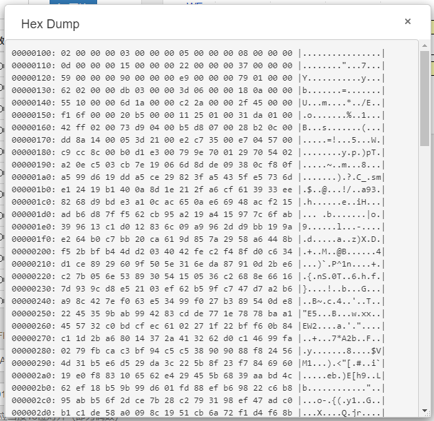
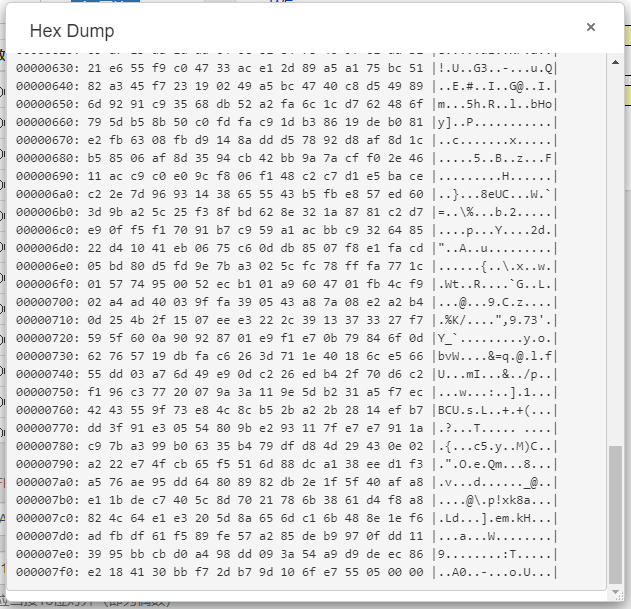

<h1 style="text-align:center"><small>计算机组成原理</small> 实验 5: 简单多周期 CPU <big>实验报告</big></h1>

李祥泽 <small>2018011331 lee_johnson@qq.com</small>

## 实验目的 ##

1.  加深对 SRAM 时序的理解;
2.  掌握指令执行阶段的含义, 熟悉执行阶段所需的控制信号;
3.  理解一个简单程序的执行流程. 

## 实验内容 ##

实现一个简单的多周期 CPU, 运行提供的汇编程序, 从 BaseRAM 的 0x100 处开始写入斐波那契数列, 直到 0x800 处. 0x7FC 写入 0x00000555 表示运行成功. 

## 实验过程 ##

我的实现将 CPU 分成以下几个模块. 

### 顶层模块 ###

也即 CPU 的整体.

程序计数器 PC, 指令寄存器 rI, 内存值寄存器 rD, 操作数寄存器 rA, rB, ALU 结果寄存器 rC等寄存器都在这个模块当中. 指令执行阶段状态机也在此模块中. 各个寄存器和状态机以时钟发生器分频得到的 10 MHz 时钟信号为主频进行更新. 

为了生成时序合适的内存控制信号, 指令阶段中和访存相关的阶段 (IF 和 MEM) 都被分割成两个状态. 

此外, 在此模块中还实例化了以下各个模块, 并将其用适当的连线和 MUX 连接起来. 

### Decoder 译码器 ###

从顶层模块中接收当前状态, 当前指令 (来自 rI 寄存器) 和 ALU 产生的 *结果为零* 标志位 flagZ. 根据这些数据, 生成当前状态所需的控制信号. 

具体来说, 控制信号包括以下这些: 

+   PC 写使能 `pcWr`, pcNow 写使能 `pcNowWr`, PC 来源选择 `pcSel`, 

+   内存地址来源选择 `memSel`, 内存读/写使能 `memRd`/`memWr`, 

+   指令寄存器写使能 `irWr`, 

+   立即数选择 `immSel`, 

+   寄存器组写使能 `regWr`, 寄存器组数据来源选择 `regDSel`, 

+   ALU 操作数来源选择 `aluASel`/`aluBSel`, ALU 操作选择 `aluOp`/`aluAlter`.

此外, 根据指令类型和当前状态生成次态的逻辑也在 Decoder 中完成. 向顶层输出此台的信号是 `stageNext`.  

### ImmGen 立即数发生器 ###

从顶层模块接收完整的指令字, 将其中合适的位拼合和扩展, 同时生成全部 5 种格式的立即数 (I, S, B, J, U); 并根据顶层模块传来的立即数选择信号 ImmSel 输出合适的立即数. 

### MemComtroller 内存控制器 ###

我的实现中, 控制器不直接生成内存芯片的控制信号, 而是生成内存控制器的使能信号. 内存控制器会根据这些使能信号, 在其中运行状态机, 控制内存芯片的读写. 

由于内存芯片要求的时序较为复杂, 内存控制器使用的不是顶层模块经过分频的 10M 时钟, 而是原始的 50M 时钟. 这保证了在顶层的 1 个周期内能够完成内存的读写操作, 从而使具体的内存控制对顶层透明化了.  

具体的控制信号生成和前一个实验是类似的. 

### RegFile 寄存器组 ###

带有复位功能, 2 个组合逻辑读取口, 1 个时序逻辑写入口的 32 bits * 32 寄存器组. 

当给复位信号时, 所有 32 个寄存器都置零. 当时钟上升沿时, 如果有写使能, 将传入的数据写入相应地址. 寄存器组的读取则是通过 `assign` 连续赋值语句实现的. 

这样实现的好处是, 如果在同一个周期里读和写同一个寄存器, 经过写入所需时间和其他延迟, 输出最终将稳定到该寄存器的新值. 这符合 *先写后读* 的约定, 可以在流水线 CPU 中使用. 

### ALU ###

与实验 2 的类似, 将位数扩展到 32 位. 

在编排操作控制码时, 注意到 R 型运算总共只有 10 个, 是用 8 种 funct3, 再加 funct7[5] 以作区分; 而  I 型运算的 funct3 与 R 型对应一致. 因此令控制码与指令字中的 funct3 一致, 并增加 1 位对应 funct7[5]. 

这样实现的好处是, 在对 R 型指令进行译码时, 只需将指令字的对应位数作为 ALU 的控制信号传出即可. 对于流水线 CPU 来说, ALU 主要处理的就是 R 型与 I 型, 其余时候只是作为加法器来使用, 这相当于减少了一级译码, 是较为方便的. 

### ClkGen 时钟发生器 ###

按实验指导书的提示, 利用 PLL 生成相位稳定的分频时钟. 

## 实验结果 ##

本实现通过了 ThinPAD-Cloud 自动评测. 评测号 13773.

在实验平台上调取内存信息如下. 可见斐波那契数列和结尾的 0x00000555. 

<figure>
	
	
</figure>

## 思考题 ##

### 1.  同样是将指令分为 5 个执行阶段, 流水线 CPU 与多周期 CPU 的不同之处在哪里? 流水线多做了哪些事情?  ###

在多周期 CPU 中, 同一时间只有一条指令的一个阶段在运行, 而流水线 CPU 的大多数时刻都是 5 条指令的 5 个不同指令阶段同时运行. 

前者的指令之间是串行关系, 而后者的指令之间是并行关系. 因此后者的效率更高. 

但是, 由于编程者认为并且期待他编写的程序按编写的顺序逐次执行, 在 CPU 中将指令并行执行将引入各种冲突. 这必须由额外的检测和规避逻辑来处理. 

### 2.  在实验过程中遇到了哪些困难, 是如何解决的?  ###

主要的困难还是来源于内存的时序. 

由于我们的内存芯片对控制信号时序的要求较多, 因此即使经过内存控制器模块的包装, 也还是需要较多的控制信号和较严格的时序. 这就要求我利用波形仿真详细对比译码器给出的使能信号, 内存控制器的运行状态和传给内存芯片的控制信号, 并做一些 (有时想不清楚为什么的) 细节调整. 

此外, 有一些控制信号应该持续给多久, 或说, 在哪个阶段可以撤掉也给我带来了一些麻烦. 在较早期的设计中, 我过早地撤除了几个选择信号, 导致错误的数据被传给了 ALU 和内存. 解决的办法是, 将这些控制信号尽可能地多维持, 直到下一条指令进入. 

在与其他同学的讨论中, 我发现有这样一种写法, 即, 在内存控制器中增加一个表示读写完成的输出信号, 在顶层状态机的访存状态中接收这个信号, 并以其作为转入下一个阶段的控制. 我认为这种写法对于多周期 CPU 串行执行的指令是可以的. 但是, 如果想扩展到流水线 CPU, 由于这种方法会导致各个阶段使用的周期数不一致, 恐怕会导致一些麻烦. 

事实上, 我认为我现在的写法 (IF, MEM 各 2 个周期, ID, EXE, WB 各 1 个周期), 由于周期数不一致 (虽然是固定的), 也不能够直接供流水线使用, 否则将导致流水线上各个阶段不能对齐, 互相重叠, 造成更严重的冲突. 暂时想到两种办法. 其一, 将内存的读写逻辑进一步包装, 使内存控制器对外的所有控制时序都能在 1 周期内完成. 其二, 将 ID, EXE, WB 三个阶段也都填充成 2 个周期.  