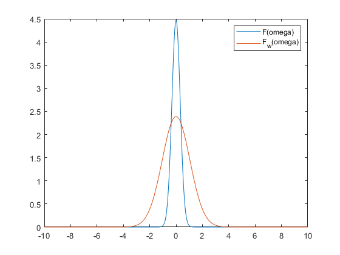

# 信号处理原理 第 5 次作业 #

李祥泽 2018011331

## 1 ##

对于信号 $x(t)=\cos(\omega_0 t + \varphi)$, 其频谱如下图所示: 

作 $\omega_0 < \omega_s < 2\omega_0$ 的采样, 得到的频谱如下图: 

作 $\omega_s - \omega_0 < \omega_c < \omega_0$ 的理想内插, 得到的是下图中矩形阴影中的部分. 

其表达式为 $X_r(j\omega)=\pi e^{j\varphi}\delta(\omega+(\omega_s-\omega_0))+\pi e^{-j\varphi}\delta(\omega-(\omega_s-\omega_0))$.

作逆傅里叶变换, 得到 $x_r(t)=\cos((\omega_s-\omega_0)t-\varphi)$. 这说明, 对带初相位的简谐波作欠采样, 不仅会导致恢复出的信号频率降低, 还会导致相位反转. 

## 2 ##

### a. ###

$$
\mathcal{F}[f(t)]=\int_{-\infty}^{+\infty}{e^{\frac{-t^2}{20}}e^{-j\omega t}\text{d}t}
=2\sqrt{5} \cdot e^{-5\omega^2}
$$

### b. ###

有 $w(t,0)=e^{\frac{-t^2}{2}}$. 由傅里叶变换的时移特性, 窗口函数的频谱为 $F_w(\omega,t_0)=\sqrt{2\pi}e^{-\frac12\omega^2-j\omega t_0}$. 

由 $f_w=f\cdot w$: 
$$
\begin{align}
\mathcal{F}[f_w] &= \frac{1}{2\pi}F(\omega)*F_w(\omega,0) \\
&= \frac{1}{2\pi} \int_{-\infty}^{+\infty}{F(\omega-w)F_w(w)\text{d}w} \\
&= \frac{2\sqrt{55\pi}}{11}\cdot e^{-\frac{5\omega^2}{11}}
\end{align}
$$

### c. ###

画图如下: 

可以看到, 使用窗口节选使原频谱的低频分量减弱而高频分量增强, 体现出 “压扁” 的特征. 